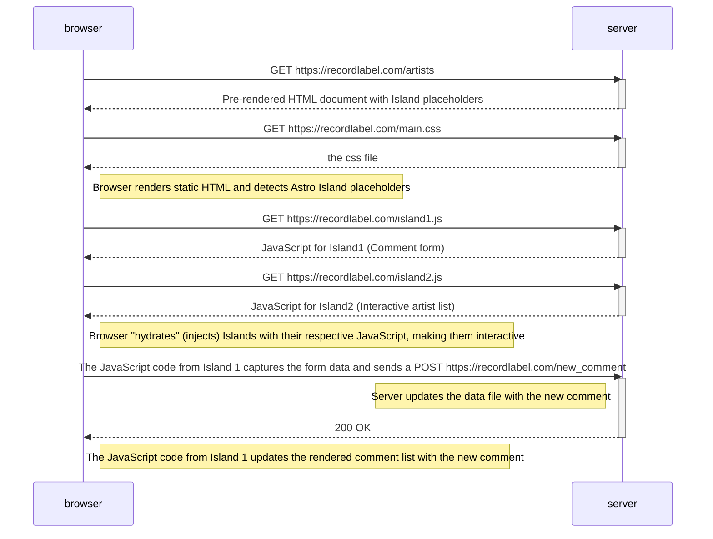

```mermaid
sequenceDiagram
    participant browser
    participant server

    browser->>server: GET https://recordlabel.com/artists
    activate server
    server-->>browser: Pre-rendered HTML document with Island placeholders
    deactivate server

    browser->>server: GET https://recordlabel.com/main.css
    activate server
    server-->>browser: the css file
    deactivate server

    Note right of browser: Browser renders static HTML and detects Astro Island placeholders

    browser->>server: GET https://recordlabel.com/island1.js
    activate server
    server-->>browser: JavaScript for Island1 (Comment form)
    deactivate server

    browser->>server: GET https://recordlabel.com/island2.js
    activate server
    server-->>browser: JavaScript for Island2 (Interactive artist list)
    deactivate server

    Note right of browser: Browser "hydrates" (injects) Islands with their respective JavaScript, making them interactive

    browser->>server: The JavaScript code from Island 1 captures the form data and sends a POST https://recordlabel.com/new_comment
    activate server
    Note left of server: Server updates the data file with the new comment
    server-->>browser: 200 OK
    deactivate server

    Note right of browser: The JavaScript code from Island 1 updates the rendered comment list with the new comment
```
